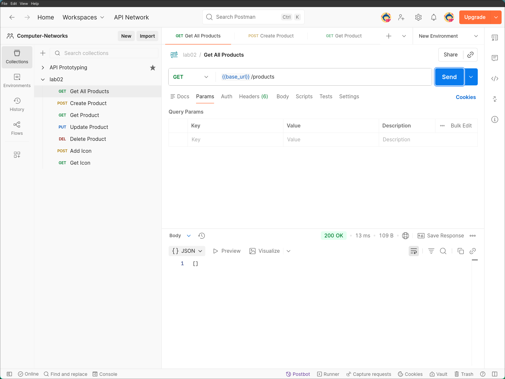
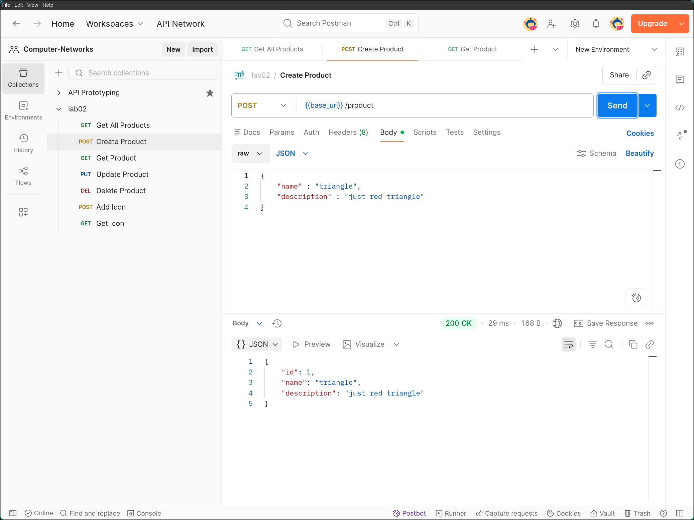
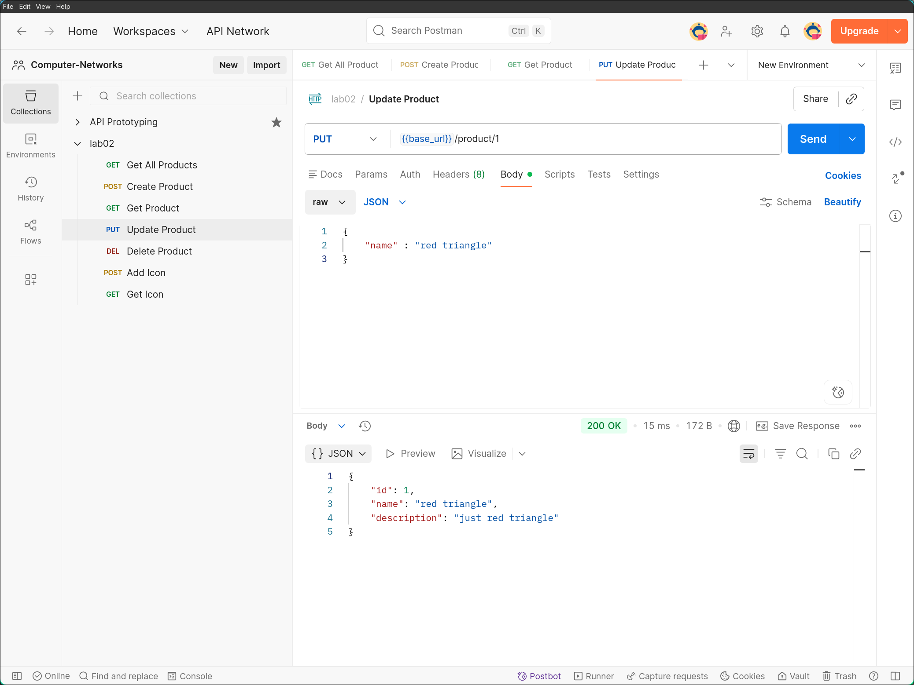
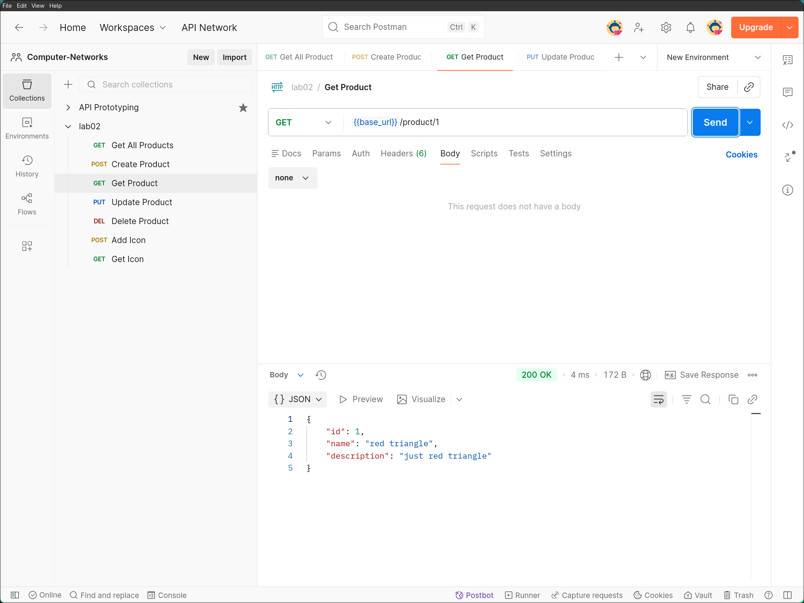
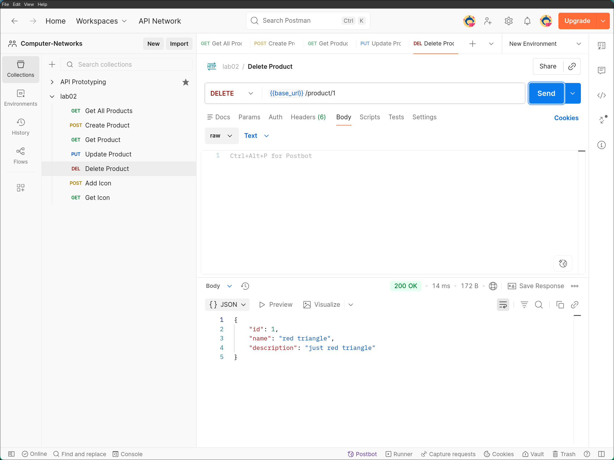
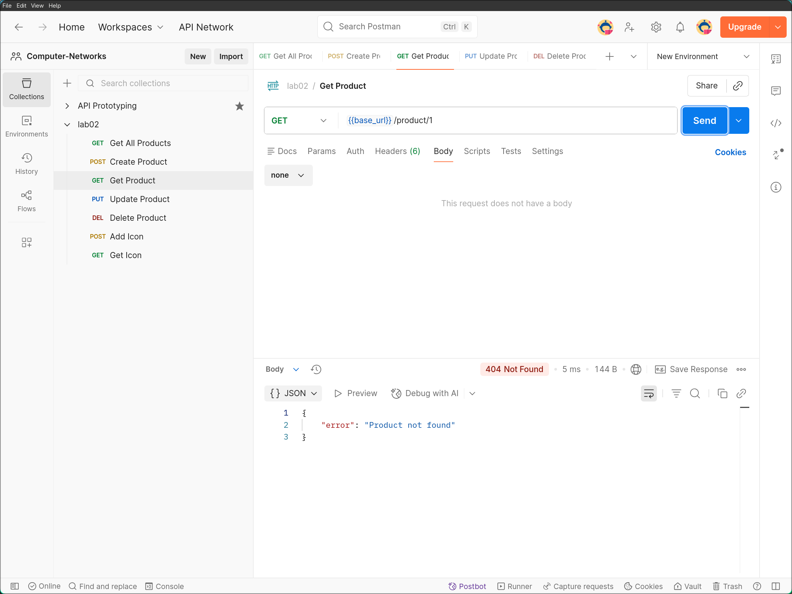
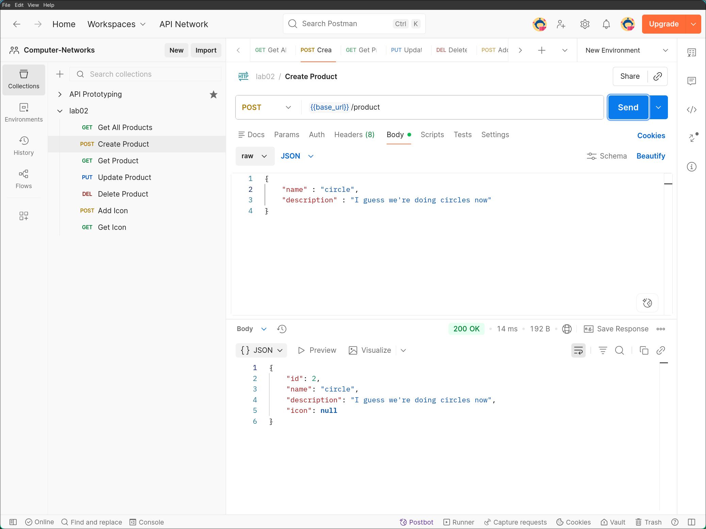
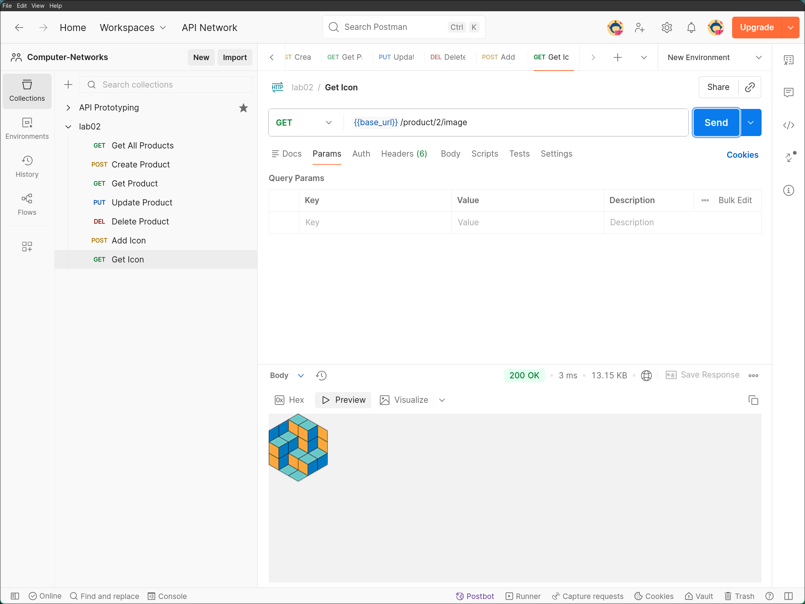

# Практика 2. Rest Service

## Программирование. Rest Service. Часть I

### Задание А (3 балла)
Создайте простой REST сервис, в котором используются HTTP операции GET, POST, PUT и DELETE.
Предположим, что это сервис для будущего интернет-магазина, который пока что умеет 
работать только со списком продуктов. У каждого продукта есть поля: `id` (уникальный идентификатор),
`name` и `description`. 

Таким образом, json-схема продукта (обозначим её `<product-json>`):

```json
{
  "id": 0,
  "name": "string",
  "description": "string"
}
```

Данные продукта от клиента к серверу должны слаться в теле запроса в виде json-а, **не** в параметрах запроса.

Ваш сервис должен поддерживать следующие операции:
1. Добавить новый продукт. При этом его `id` должен сгенерироваться автоматически
   - `POST /product`
   - Схема запроса:
     ```json
     {
       "name": "string",
       "description": "string"
     }
     ```
   - Схема ответа: `<product-json>` (созданный продукт)
2. Получить продукт по его id
   - `GET /product/{product_id}`
   - Схема ответа: `<product-json>`
3. Обновить существующий продукт (обновляются только те поля продукта, которые были переданы в теле запроса)
   - `PUT /product/{product_id}`
   - Схема запроса: `<product-json>` (некоторые поля могут быть опущены)
   - Схема ответа: `<product-json>` (обновлённый продукт)
4. Удалить продукт по его id
   - `DELETE /product/{product_id}`
   - Схема ответа: `<product-json>` (удалённый продукт)
5. Получить список всех продуктов 
   - `GET /products`  
   - Схема ответа:
     ```
     [ 
       <product-json-1>,
       <product-json-2>, 
       ... 
     ]
     ```

Предусмотрите возвращение ошибок (например, если запрашиваемого продукта не существует).

Вы можете положить код сервиса в отдельную директорию рядом с этим документом.

### Задание Б (3 балла)
Продемонстрируйте работоспособность сервиса с помощью программы Postman
(https://www.postman.com/downloads) и приложите соответствующие скрины, на которых указаны
запросы и ответы со стороны сервиса для **всех** его операций.

#### Сборка
Сборка и запуск производятся из корня репозитория.
```
cargo build --bin "lab02"
```
#### Запуск
```
mkdir lab02/data
./target/debug/lab02 -d lab02/data
```
Флаги `-h` и `--help` выводят доступные флаги в стандартный поток вывода.
Директорию для хранения данных указывается с помощью флагов `-d` и `--data-dir`.
Порт сервера можно указать с помощью флагов `-p` и `--port`, дефолтное значение `3000`.

#### Демонстрация работы

Скриншоты в таблице иллюстрируют 3 юзерстори:
- создание нового продукта
- изменение существующего
- удаление продукта

|  |     |  |
|------------------------------------|---------------------------------|------------------------------|
|         |      |                              |
|      |  |                              |

### Задание В (4 балла)
Пусть ваш продукт также имеет иконку (небольшую картинку). Формат иконки (картинки) может
быть любым на ваш выбор. Для простоты будем считать, что у каждого продукта картинка одна.

Добавьте две новые операции:
1. Загрузить иконку:
   - `POST product/{product_id}/image`
   - Запрос содержит бинарный файл — изображение  
     
2. Получить иконку:
   - `GET product/{product_id}/image`
   - В ответе передаётся только сама иконка  
     

Измените операции в Задании А так, чтобы теперь схема продукта содержала сведения о загруженной иконке, например, имя файла или путь:
```json
"icon": "string"
```

#### Демонстрация работы

Команды для сборки и запуска остаются такими же.

Изображения иллюстрируют создание продукта, добавление иконки, получение иконки и измененную json-схему продуктов:

|  |        | 
|--------------------------------|--------------------------------|
|        |  |

---

_(*) В последующих домашних заданиях вам будет предложено расширить функционал данного сервиса._

## Задачи

### Задача 1 (2 балла)
Общая (сквозная) задержка прохождения для одного пакета от источника к приемнику по пути,
состоящему из $N$ соединений, имеющих каждый скорость $R$ (то есть между источником и
приемником $N - 1$ маршрутизатор), равна $d_{\text{сквозная}} = N \dfrac{L}{R}$
Обобщите данную формулу для случая пересылки количества пакетов, равного $P$.

#### Решение
Понятно, что достаточно посчитать время, через которое последний пакет достигнет приемника.

После старта передачи пакетов все пакеты кроме последнего пройдут через первое соединение за 
$\dfrac{(P-1) L}{R}$, поскольку будут передаваться один за другим без простоев. 

В этот момент начнется передача последнего пакета, который будет приходить на каждый следующий 
маршрутизатор последним, сразу после того как предыдущий пакет успел окончательно отправиться дальше, 
поэтому каких-либо блокировок не возникнет и последний пакет достигнет приемника еще через $\dfrac{N L}{R}$.

Ответ: $\dfrac{(N + P - 1) L}{R}$

### Задача 2 (2 балла)
Допустим, мы хотим коммутацией пакетов отправить файл с хоста A на хост Б. Между хостами установлены три
последовательных канала соединения со следующими скоростями передачи данных:
$R_1 = 200$ Кбит/с, $R_2 = 3$ Мбит/с и $R_3 = 2$ Мбит/с.
Сколько времени приблизительно займет передача на хост Б файла размером $5$ мегабайт?
Как это время зависит от размера пакета?

#### Решение
Ботлнеком такого соединения будет первый канал. Если файл разобьется на пакеты размером по $L$,
то через первый канал они пройдут за $\dfrac{5МБ}{200 Кбит/с} = 200c$, а затем последний пакет пройдет через
два оставшихся канала за $\dfrac{L}{3Мбит/с} + \dfrac{L}{2Мбит/с} = \dfrac{5L}{6Мбит/с}$. 

Учитывая, что размер TCP пакета обычно в районе пары килобайт, второе выражение оценится
$\dfrac{5L}{6Мбит/с} \approx \dfrac{5 \times 2КБ}{6Мбит/с} \approx 0.01c$, что довольно мало.

Ответ: $200c + \dfrac{5L}{6Мбит/с} \approx 200c$

### Задача 3 (2 балла)
Предположим, что пользователи делят канал с пропускной способностью $2$ Мбит/с. Каждому
пользователю для передачи данных необходима скорость $100$ Кбит/с, но передает он данные
только в течение $20$ процентов времени использования канала. Предположим, что в сети всего $60$
пользователей. А также предполагается, что используется сеть с коммутацией пакетов. Найдите
вероятность одновременной передачи данных $12$ или более пользователями.

#### Решение
У нас фиксированное число независимых пользователей, поэтому количество $U$ одновременных пользователей,
передающих данные описывается биномиальным распределением $U \sim Bin(60, 0.2)$.

Нам надо оценить $P(U >= 12)$, сделаем это с помощью питона:
```python
>>> import scipy.stats as ss 
>>> ss.binom(60, 0.2).sf(11)
np.float64(0.5513825262506507)
```

Btw, можно вспомнить о вероятности перегрузка сети, когда пользователей больше 
$20 = \dfrac{2 Мбит/с}{100 Кбит/с}$, правда она мала и на нее забиваем:
```python
>>> ss.binom(60, 0.2).sf(20)
np.float64(0.004825719056304883)
```

Ответ: $\approx 55\%$


### Задача 4 (2 балла)
Пусть файл размером $X$ бит отправляется с хоста А на хост Б, между которыми три линии связи и
два коммутатора. Хост А разбивает файл на сегменты по $S$ бит каждый и добавляет к ним
заголовки размером $80$ бит, формируя тем самым пакеты длиной $L = 80 + S$ бит. Скорость
передачи данных по каждой линии составляет $R$ бит/с. Загрузка линий мала, и очередей пакетов
нет. При каком значении $S$ задержка передачи файла между хостами А и Б будет минимальной?
Задержкой распространения сигнала пренебречь.

#### Решение
В первом задании уже вывели забавную формулу: $\dfrac{(N + P - 1) L}{R}$, давайте ее применим. 
В нашем случае $P = X / S$, $N = 3$, подставим в формулу: 

$$ \frac{(X / S + 2) (80 + S)}{R} = \frac{1}{R} \left(\frac{80 X}{S} + (X + 160) + 2S\right) $$

Минимум $\dfrac{80 X}{S} + 2S$ достигается в точке, где $\dfrac{80 X}{S} = 2S$, поскольку это 
сумма двух чисел с фиксированным произведением. Т.е. $S = 2 \sqrt{10X}$ и тогда значение задержки
будет равно 

$$ \frac{\frac{80 X}{S} + (X + 160) + 2S}{R} = \frac{4 \sqrt{10X} + (X + 160) + 4 \sqrt{10X}}{R} = \frac{X + 8 \sqrt{10X} + 160}{R} $$

Ответ: $S = 2 \sqrt{10X}$

### Задание 5 (2 балла)
Рассмотрим задержку ожидания в буфере маршрутизатора. Обозначим через $I$ интенсивность
трафика, то есть $I = \dfrac{L a}{R}$.
Предположим, что для $I < 1$ задержка ожидания вычисляется как $\dfrac{I \cdot L}{R (1 – I)}$. 
1. Напишите формулу для общей задержки, то есть суммы задержек ожидания и передачи.
2. Опишите зависимость величины общей задержки от значения $\dfrac{L}{R}$.

#### Решение

$$ d_{ожидание} = \dfrac{I L}{R(1-I)} $$

$$ d_{передача} = \dfrac{L}{R} $$

$$ d = d_{ожидание} + d_{передача} = \dfrac{I L}{R(1-I)} + \dfrac{L}{R} = \dfrac{L}{R}\left(\dfrac{I}{1-I} + 1\right) = \dfrac{L}{R (1 - I)} $$

Если мы обозначим $\dfrac{L}{R}$ за $X$, то формула упрощается до  

$$ d = \dfrac{L}{R \left(1 - \dfrac{L a}{R}\right)} = \dfrac{X}{1 - aX} $$

График этой штуки имеет форму гиперболы, которая проходит через $(0,0)$ и стремится к 
бесконечности, когда $X$ приближается к $1 / a$

То есть когда $I \approx 1$ задержка становится огромной, но если узел загружен
не сильно ($I \approx 0$), то задержка на ожидание примерно $0$ и основной вклад вносит 
задержка передачи, которая зависит линейно
