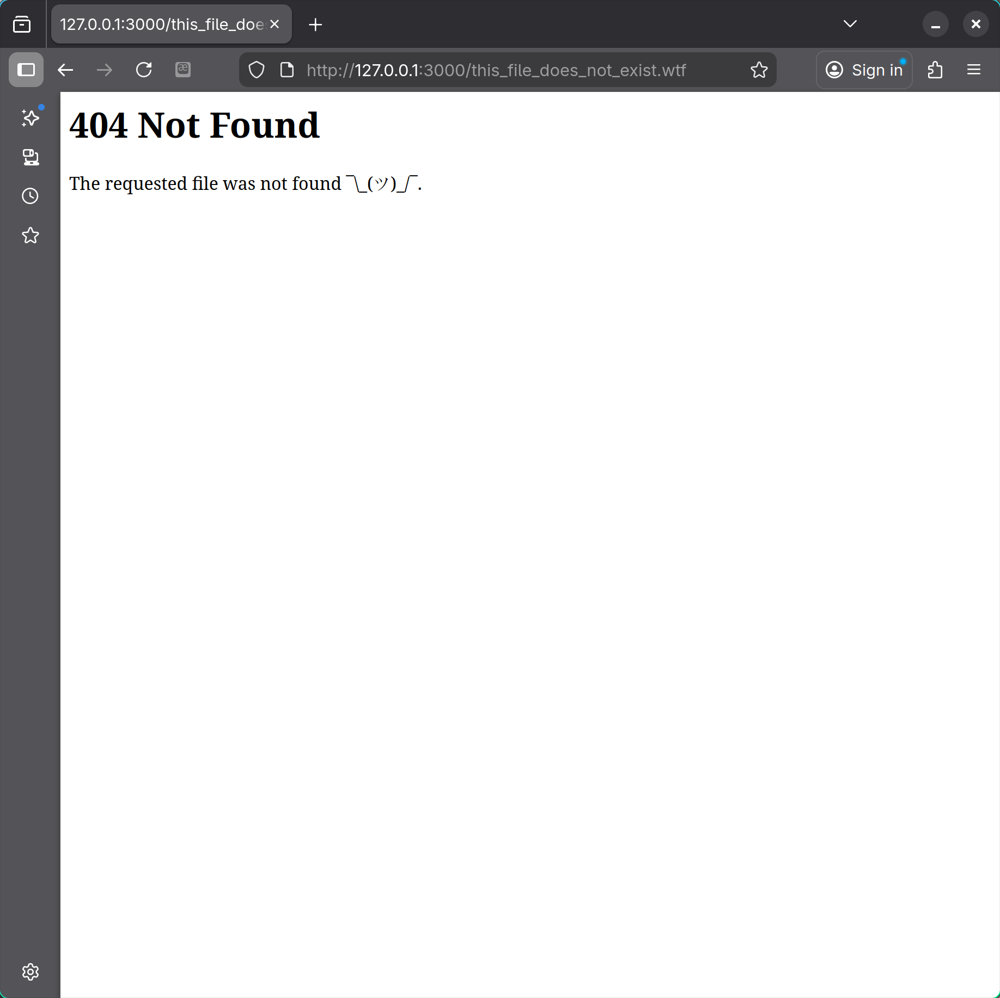
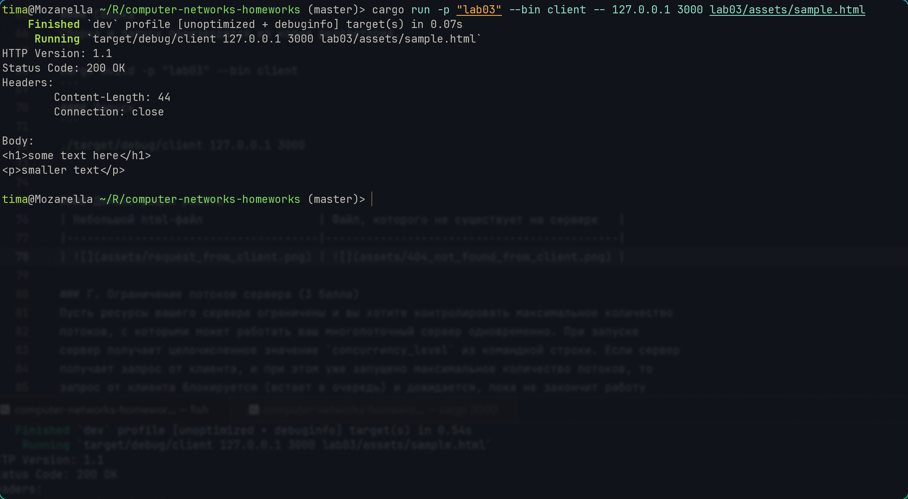
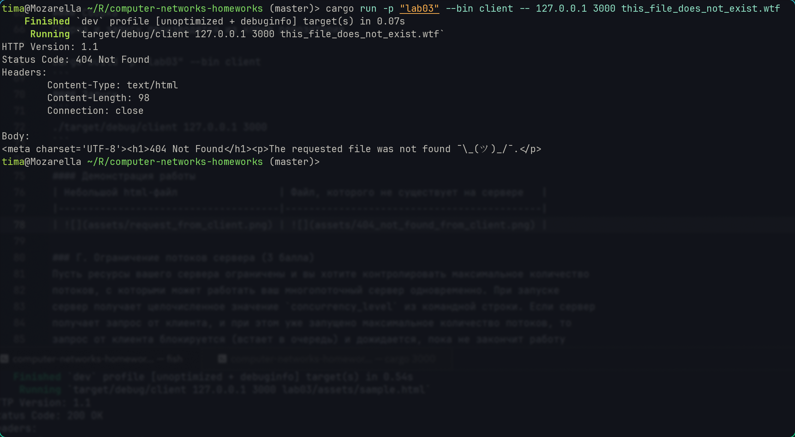

# Практика 3. Прикладной уровень

## Программирование сокетов. Веб-сервер

### А. Однопоточный веб-сервер (3 балла)
Вам необходимо разработать простой веб-сервер, который будет возвращать содержимое
локальных файлов по их имени. В этом задании сервер умеет обрабатывать только один запрос и
работает в однопоточном режиме. Язык программирования вы можете выбрать любой.
Требования:
- веб-сервер создает сокет соединения при контакте с клиентом (браузером) получает HTTP-запрос из этого соединения
- анализирует запрос, чтобы определить конкретный запрашиваемый файл
- находит запрошенный файл в своей локальной файловой системе
- создает ответное HTTP-сообщение, состоящее из содержимого запрошенного файла и предшествующих ему строк заголовков
- отправляет ответ через TCP-соединение обратно клиенту
- если браузер запрашивает файл, которого нет на веб-сервере, то сервер должен вернуть сообщение об ошибке «404 Not Found»

Ваша задача – разработать и запустить свой локальный веб-сервер, а затем проверить его
работу при помощи отправки запросов через браузер. Продемонстрируйте работу сервера, приложив скрины.

Скорее всего порт 80 у вас уже занят, поэтому вам необходимо использовать другой порт для
работы вашей программы.

Формат команды для запуска сервера:
```
<server.exe> server_port
```

#### Сборка
Сборка и запуск производятся из корня репозитория.
```
cargo build -p "lab03" --bin server
```
#### Запуск
```
./target/debug/server 3000
```
(btw, можно сделать одной командой `cargo run -p "lab03" --bin server -- 3000`)

#### Демонстрация работы
| Небольшой html-файл                  | Файл, которого не существует на сервере    |
|--------------------------------------|--------------------------------------------|
|  |  |

### Б. Многопоточный веб-сервер (2 балла)
Реализуйте многопоточный сервер, который мог бы обслуживать несколько запросов
одновременно. Сначала создайте основной поток (процесс), в котором ваш модифицированный
сервер ожидает клиентов на определенном фиксированном порту. При получении запроса на
TCP-соединение от клиента он будет устанавливать это соединение через другой порт и
обслуживать запрос клиента в отдельном потоке. Таким образом, для каждой пары запрос-ответ
будет создаваться отдельное TCP-соединение в отдельном потоке.

### В. Клиент (2 балла)
Вместо использования браузера напишите собственный HTTP-клиент для тестирования вашего
веб-сервера. Ваш клиент будет поддерживать работу с командной строкой, подключаться к
серверу с помощью TCP-соединения, отправлять ему HTTP-запрос с помощью метода GET и
отображать ответ сервера в качестве результата. Клиент должен будет в качестве входных
параметров принимать аргументы командной строки, определяющие IP-адрес или имя сервера,
порт сервера и имя файла на сервере. Продемонстрируйте работу клиента, приложив скрины. 

Формат команды для запуска клиента:
```
<client.exe> server_host server_port filename
```

#### Сборка
Сборка и запуск производятся из корня репозитория.
```
cargo build -p "lab03" --bin client
```
#### Запуск
```
./target/debug/client 127.0.0.1 3000
```

#### Демонстрация работы
| Небольшой html-файл                 | Файл, которого не существует на сервере   |
|-------------------------------------|-------------------------------------------|
|  |  |

### Г. Ограничение потоков сервера (3 балла)
Пусть ресурсы вашего сервера ограничены и вы хотите контролировать максимальное количество
потоков, с которыми может работать ваш многопоточный сервер одновременно. При запуске
сервер получает целочисленное значение `concurrency_level` из командной строки. Если сервер 
получает запрос от клиента, и при этом уже запущено максимальное количество потоков, то 
запрос от клиента блокируется (встает в очередь) и дожидается, пока не закончит работу 
один из запущенных потоков. После этого сервер может запустить новый поток для обработки 
запроса от клиента.

Формат команды для запуска сервера:
```
<server.exe> server_port concurrency_level
```

#### Сборка
Сборка и запуск производятся из корня репозитория.
```
cargo build -p "lab03" --bin server
```
#### Запуск
```
./target/debug/server 3000 2
```

#### Демонстрация работы
Скрипт `test_multithreading.sh` запускает сервер на порту 3000 с двумя потоками и затем запускает пять клиентов. 
Поскольку в сервер встроена искуственная трехсекундная задержка, то замеры времени ожидания клиентов позволят определить максимальное количество одновременно обрабатываемых запросов.

Из вывода скрипта ниже видно, что одновременно обрабатываются ровно 2 запроса:

```
client 3 waited for 3 seconds
client 4 waited for 3 seconds
client 0 waited for 6 seconds
client 1 waited for 6 seconds
client 2 waited for 9 seconds
```

## Задачи

### Задача 1 (2 балла)
Голосовые сообщения отправляются от хоста А к хосту Б в сети с коммутацией пакетов в режиме
реального времени. Хост А преобразует на лету аналоговый голосовой сигнал в цифровой поток
битов, имеющий скорость $128$ Кбит/с, и разбивает его на $56$-байтные пакеты. Хосты А и Б
соединены одной линией связи, в которой скорость передачи данных равна $1$ Мбит/с, а задержка
распространения составляет $5$ мс. Как только хост А собирает пакет, он посылает его на хост Б,
который, в свою очередь, при получении всего пакета преобразует биты в аналоговый сигнал.
Сколько времени проходит с момента создания бита (из исходного аналогового сигнала на хосте
A) до момента его декодирования (превращения в часть аналогового сигнала на хосте Б)?

#### Решение
Задержка передачи пакета будет равна $d_{передача} = \dfrac{56 Б}{1 М
б/с} \approx 0.45 мс$

Задержка кодирования бита равномерна распределена в пределах от $0$ до времени сборки пакета $\dfrac{56 Б}{128 Кб/c} = 3.5 мс$. Поскольку при воспроизведении пакеты воспроизводятся с такой же скоростью, то задержка декодирования конкретного бита будет иметь такое же распределение и, более того, сумма этих двух задержек будет равна $d_{(де)кодирование} = 3.5 мс$.

Судя по всему, предполагается что заержкой обработки пакета можно пренебречь и итоговая задержка будет складываться из трех:

$$ d = d_{передача} + d_{распространение} + d_{(де)кодирование} \approx 0.45 мс + 5 мс + 3.5 мс \approx 9 мс $$

#### Ответ:
$d \approx 9 мс$

### Задача 2 (2 балла)
Рассмотрим буфер маршрутизатора, где пакеты хранятся перед передачей их в исходящую линию
связи. В этой задаче вы будете использовать широко известную из теории массового
обслуживания (или теории очередей) формулу Литтла. Пусть $N$ равно среднему числу пакетов в
буфере плюс пакет, который передается в данный момент. Обозначим через $a$ скорость
поступления пакетов в буфер, а через $d$ – среднюю общую задержку (т.е. сумму задержек
ожидания и передачи), испытываемую пакетом. Согласно формуле Литтла $N = a \cdot d$.
Предположим, что в буфере содержится в среднем $10$ пакетов, а средняя задержка ожидания для
пакета равна $10$ мс. Скорость передачи по линии связи составляет $100$ пакетов в секунду.
Используя формулу Литтла, определите среднюю скорость поступления пакета в очередь,
предполагая, что потери пакетов отсутствуют.

#### Решение
Выведем скорость поступления пакетов из формулы Литтла:

$$ N = a \cdot d = a \cdot (d_{ожидание} + d_{передача}) $$

Нетривиальное наблюдение: $N = 10 + 1 = 11$ пакетов

Далее все просто:

$$ a = \dfrac{N}{d_{ожидание} + d_{передача}} = \dfrac{11 пакетов}{10 мс + \frac{1 пакет}{100 пакетов/с}} = \dfrac{11 пакетов}{0.01 с + 0.01 с} = 550 пакетов/с $$

#### Ответ:
$550$ пакетов в секунду

### Задача 3 (2 балла)
Рассмотрим рисунок.


Предположим, нам известно, что на маршруте от сервера до клиента узким местом
является первая линия связи, скорость передачи данных по которой равна $R_S$ бит/с.
Допустим, что мы отправляем два пакета друг за другом от сервера клиенту, и другой
трафик на маршруте отсутствует. Размер каждого пакета составляет $L$ бит, а скорость
распространения сигнала по обеим линиям равна $d_{\text{распространения}}$.

1. Какова временная разница прибытия пакетов к месту назначения? То есть, сколько
времени пройдет от момента получения клиентом последнего бита первого пакета до
момента получения последнего бита второго пакета?

2. Теперь предположим, что узким местом является вторая линия связи (то есть $R_C < R_S$).
Может ли второй пакет находиться во входном буфере, ожидая передачи во вторую
линию? Почему? Если предположить, что сервер отправляет второй пакет, спустя $T$ секунд
после отправки первого, то каково должно быть минимальное значение $T$, чтобы очередь
во вторую линию связи была нулевая? Обоснуйте ответ.

#### Решение

1. Посчитаем, сколько времени пройдет от начала отправки первого пакета сервером до получения последнего его бита клиентом.

    Сервер отправляет весь пакет за время $\dfrac{L}{R_S}$, после этого через $d_{распространения}$ последний бит долетает до маршрутизатора и только в этот момент начинается передача пакета от маршрутизатора клиенту, которая занимает еще $\dfrac{L}{R_C} + d_{распространения}$ времени. 
    
    Итого, пакет дойдет за $\dfrac{L}{R_S} + \dfrac{L}{R_C} + 2 d_{распространения}$

    Для второго пакета можно провести аналогичные раccуждения:

    Сервер начинает отправлять пакет сразу после конца отправки предыдущего, то есть в момент  $\dfrac{L}{R_S}$, значит в момент $2 \dfrac{L}{R_S} + d_{распространения}$ последний бит второго пакета долетает до маршрутизатора и т.к. $2 \dfrac{L}{R_S} + d_{распространения} > \dfrac{L}{R_S} + \dfrac{L}{R_C} + d_{распространения}$, то предыдущий пакет уже полностью улетит с маршрутизатора и потому второй пакет задерживаться не будет.
    
    В итоге он дойдет до клиента за то же самое время $\dfrac{L}{R_S} + \dfrac{L}{R_C} + 2 d_{распространения}$, и потому разница прибытия пакетов будет равна $\dfrac{L}{R_S}$.

2. Поскольку во втором случае боттлнэком будет вторая линия, то второй пакет будет вынужден подождать от момента прибытия в маршрутизатор $2 \dfrac{L}{R_S} + d_{распространения}$ до момента, когда первый пакет полностью покинет маршрутизатор $\dfrac{L}{R_S} + \dfrac{L}{R_C} + d_{распространения}$.
    
    То есть он будет простаивать в буфере время $\dfrac{L}{R_C} - \dfrac{L}{R_S}$.

    Чтобы этого избежать серверу надо внести задержку между концом отправки одного пакета и началом отправки следующего равную $\dfrac{L}{R_C} - \dfrac{L}{R_S}$, т.е. интервал между началом отправки соседних пакетов будет равен $T = \dfrac{L}{R_S} + \left(\dfrac{L}{R_C} - \dfrac{L}{R_S}\right) = \dfrac{L}{R_C}$.

#### Ответ:

1. Разница прибытия пакетов равна $\dfrac{L}{R_S}$
2. $T = \dfrac{L}{R_C}$

### Задача 4 (4 балла)


На рисунке показана сеть организации, подключенная к Интернету:
Предположим, что средний размер объекта равен $850000$ бит, а средняя скорость
запросов от браузеров этой организации к веб-серверам составляет $16$ запросов в секунду.
Предположим также, что количество времени, прошедшее с момента, когда внешний
маршрутизатор организации пересылает запрос HTTP, до момента, пока он не получит
ответ, равно в среднем три секунды. Будем считать, что общее среднее время ответа
равно сумме средней задержки доступа (то есть, задержки от маршрутизатора в
Интернете до маршрутизатора организации) и средней задержки в Интернете. Для
средней задержки доступа используем формулу $\dfrac{\Delta}{1 - \Delta \cdot B}$, 
где $\Delta$ – это среднее время, необходимое для отправки объекта по каналу связи, 
а B – частота поступления объектов в линию связи.

1. Найдите $\Delta$ (это среднее время, необходимое для отправки объекта по каналу связи).
2. Найдите общее среднее время ответа.
3. Предположим, что в локальной сети организации присутствует кэширующий
сервер. Пусть коэффициент непопадания в кэш равен $0.4$. Найдите общее время ответа.

#### Решение
Среднее время, необходимое для отправки объекта по каналу связи равно $\Delta = \dfrac{850000 бит}{15 Мбит/с} \approx 0.0567 с = 56.7 мс$

Также $B = 16$ запросов в секунду, средняя задержка в Интернете $3с$, задержка передачи внутри сети организации $\dfrac{850000 бит}{100 Мбит/с} = 0.0085 = 8.5 мс$ --- мала по сравнению с другими задержками, ее можно опустить, потому общее среднее время ответа равно $3с + \dfrac{\Delta}{1 - \Delta \cdot B} = 3с + \dfrac{0.0567 с}{1 - 0.0567 с \cdot 16 с^{-1}} \approx 3с + 0.61с = 3.61 с$

Если добавить кэширующий сервер с коэффициентом непопадания $0.4$, то 40% запросов будут ходить во внешнюю сеть и потому новая частота запросов $B' = 16 \cdot 0.4 = 6.4$ запроса в секунду.

Задержка доступа станет равна $\frac{\Delta}{1 - \Delta \cdot B'} = \frac{0,0567}{1 - 0,0567 \cdot 6,4} \approx 0.089с$, суммарная задержка при промахе будет равна $3.089 с$.

Оставшиеся 60% запросов будут попадать в кэш и занимать $8.5мс$, в среднем это $0.4 * 3.089 + 0.6 * 0.0085 \approx 1.24с$

#### Ответ:

1. $\Delta = 56.7 мс$
2. Общее среднее время ответа: $3.61с$
3. Общее среднее время ответа с кешем: $1.24с$
